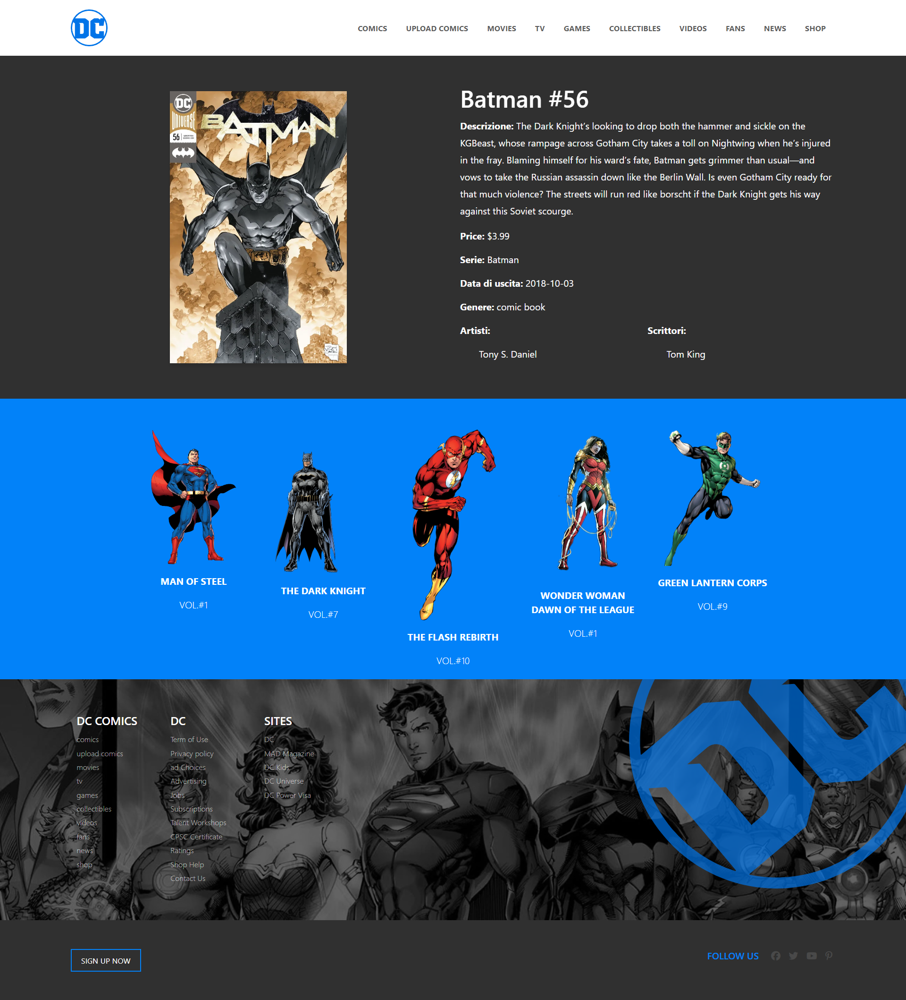

# Progetto Laravel Comics

Questo progetto è stato sviluppato utilizzando il framework Laravel. L'applicazione gestisce un database di fumetti, consentendo agli utenti di visualizzare, aggiungere e gestire informazioni dettagliate su diversi fumetti.
# Struttura del progetto

Il progetto include le seguenti funzionalità principali:

Migrazione Iniziale:

La prima migrazione ha creato la struttura delle colonne nel database per memorizzare le informazioni sui fumetti. Le colonne includono:

    Descrizione
    Titolo
    Serie
    Data
    Prezzo
    Tipo
    Immagine
    Artisti
    Scrittori
    
    Seeder JSON:

La seconda migrazione ha popolato il database con i dati iniziali dei fumetti. Questi dati sono stati inseriti utilizzando un seeder che ha importato le informazioni da un file JSON contenente diversi fumetti con le relative informazioni.
Inserimento Dati:

È stata creata una pagina che permette l'inserimento di nuovi dati nel database da parte dell'utente. Questa pagina include un form che raccoglie tutte le informazioni necessarie sui fumetti.
Visualizzazione Dettagli Fumetto:

È stata creata una scheda dettagliata che permette di visualizzare le informazioni complete di ogni fumetto. Gli utenti possono cliccare su un fumetto dalla lista per visualizzare i dettagli.
Visualizzazione Tutti i Fumetti:

È stata creata una pagina che mostra una lista di tutti i fumetti presenti nel database. Ogni fumetto è visualizzato come una card con un'immagine, titolo e un link per visualizzare i dettagli completi.
## Preview

## installazione

Installazione
Per installare e configurare il progetto, seguire questi passaggi:

Clonare il repository:

Copia codice

git clone https://github.com/LivingtonMerello98/laravel-dc-comics.git

Installare le dipendenze:

Copia codice

    cd laravel-comics
    composer install
    npm install
    npm run dev
    Configurare il file .env:

Copiare il file .env.example in .env e configurare le impostazioni del database.
Eseguire le migrazioni:

Copia codice

    php artisan migrate
    Popolare il database:

Copia codice

    php artisan db:seed
    Avviare il server locale:

Copia codice

    php artisan serve

Utilizzo: 

Visualizzazione di tutti i fumetti: Accedere alla pagina principale per vedere la lista di tutti i fumetti disponibili.

Visualizzazione dei dettagli: 

Cliccare su un fumetto nella lista per visualizzare i dettagli completi.

Aggiunta di un nuovo fumetto:

Utilizzare il form di inserimento per aggiungere un nuovo fumetto al database.

Struttura del Progetto
Migrazioni: Le migrazioni si trovano nella cartella database/migrations.
Seeder: Il seeder che importa i dati dal file JSON si trova nella cartella database/seeders.
Controller: I controller per gestire le logiche di business si trovano nella cartella app/Http/Controllers.
Modelli: I modelli Eloquent si trovano nella cartella app/Models.
Views: Le viste Blade si trovano nella cartella resources/views.
## 🚀 About Me

•Nome: Livington Merello 

•Email: livington.merello@gmail.com

•GitHub: LivingtonMerello98
